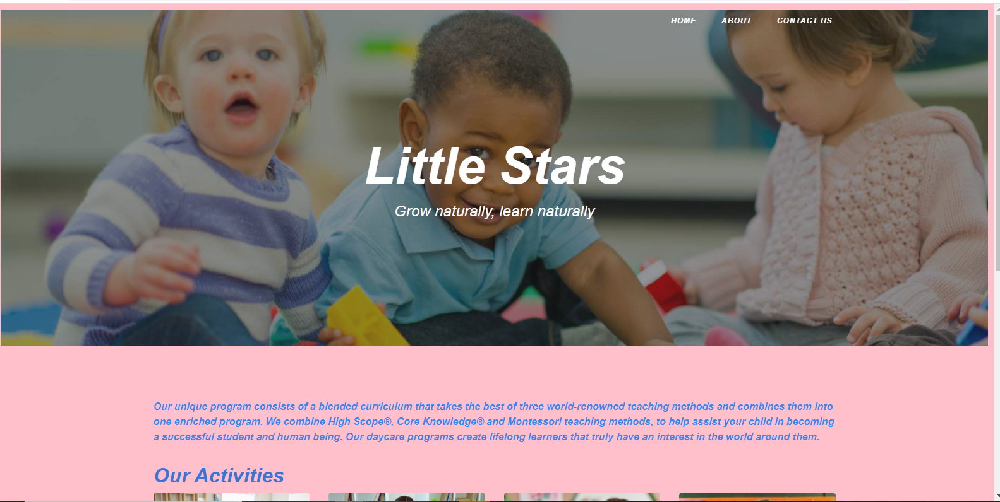
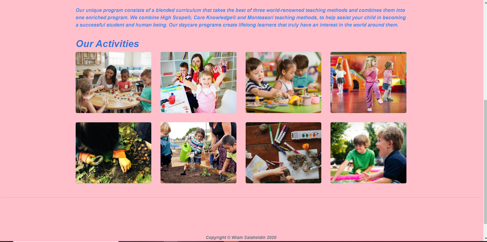

**Little Stars**
Grow naturally, learn naturally

**About Little Stars**
This project demonestrate my skills on flask.

**Project requierments**
3 pages at least
Folders:
• Folder “templates” ➔ AT LEAST 3 html pages plus the template page (base.html) ➔ Total: 4 HTML templates (files) inside the folder “templates”
• Folder “static” ➔ images, css, js, etc…
• Folder “data” ➔ Very simple JSON file to be called and displayed in any html page
Required Files/Code:
1. One HTML page contains a form with at least 3 fields, when the form is submitted, you can either use the code in a or b: a) You can display the result (feedback) within the same contact us page (LMS outline) b) Or you can display the result in a separate page (like our in-class example “Flask-Intro”):
o One page to display the form
o Another html page to process the form (Yes, you will have another html page)
2. One HTML page contains a data that are displayed from a JSON file
3. Some images
Final Steps:
1. You will commit your code to GitHub as we have done before (using any repo name)
2. deploy your project into Heroku website

**Languages**

* HTML

* CSS

* BootStrap

* python

* flask framework

__screen blueprint__

[__Click_here__](https://little-stars-wiam.herokuapp.com/)

